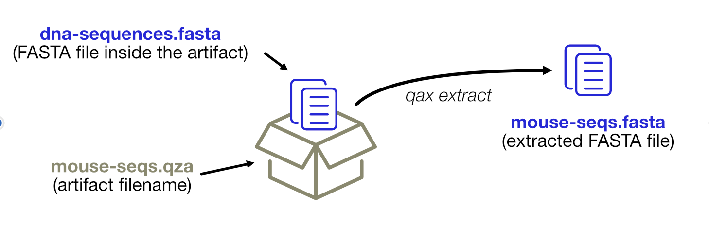

# qax extract

This subprogram will extract data files from artifacts.
Can be abbreviated with **x** (_e. g._, `qax x ...`).



### Synopsis:

```
Usage: extract [options] [<inputfile> ...]

Extract the artifact data. If multiple files are present, a new directory
will be created (artifact name), otherwise the artifact name will be used
to rename the single file (unless -k is specified).

Options:
  -o, --outdir DIR       Output directory [default: .]
  -k, --keepname         Keep original file names instead of using artifact's basename [default: false]
  -v, --verbose          Verbose output
  -h, --help             Show this help
```

### Behaviour

When a datafile contains a single file (feature table, representative sequences,...) it will be extracted to 
the output directory inheriting the name from the artifact's name.
Otherwise (visualizations, ...) it will be extracted to a subdirectory with the artifact's name.