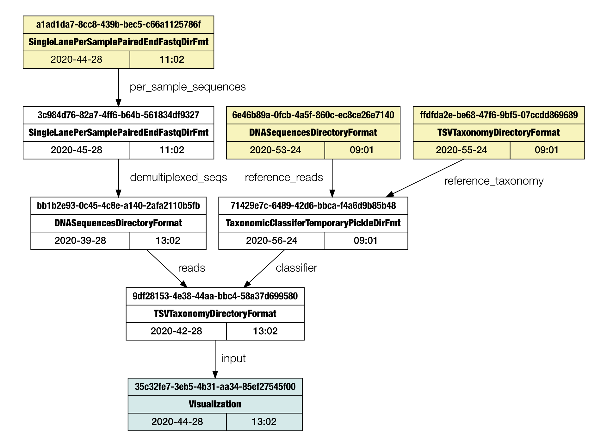

# qax provenance

This subprogram will print the provenance of an artifact, optionally saved as graph.
Can be abbreviated with **p** (_e. g._, `qax p ...`).



### Synopsis:

```
Usage: provenance [options] <inputfile>

Print ancestry of an artifact

Options:
  -o, --dotfile DOTFILE  Save graphviz graph (dot format)
  -p, --pdf              Generate PDF of the graph (requires -o and "dot" installed)
  -f, --font FONT        Font name for the PDF [default: Arial]
  -v, --verbose          Verbose output
  -h, --help             Show this help
```


### Text output

By default only a textual summary will be printed like: 
```
6e46b89a-0fcb-4a5f-860c-ec8ce26e7140    top     2020-01-24 09:01        reference_reads         [inputs: <none>]
ffdfda2e-be68-47f6-9bf5-07ccdd869689    top     2020-01-24 09:01        reference_taxonomy      [inputs: <none>]
71429e7c-6489-42d6-bbca-f4a6d9b85b48    |       2020-01-24 09:01        classifier              [inputs: 6e46b89a-0fcb-4a5f-860c-ec8ce26e7140;ffdfda2e-be68-47f6-9bf5-07ccdd869689;null]
a1ad1da7-8cc8-439b-bec5-c66a1125786f    top     2020-02-28 11:02        per_sample_sequences    [inputs: <none>]
3c984d76-82a7-4ff6-b64b-561834df9327    |       2020-02-28 11:02        demultiplexed_seqs      [inputs: a1ad1da7-8cc8-439b-bec5-c66a1125786f]
bb1b2e93-0c45-4c8e-a140-2afa2110b5fb    |       2020-02-28 13:02        reads                   [inputs: 3c984d76-82a7-4ff6-b64b-561834df9327]
9df28153-4e38-44aa-bbc4-58a37d699580    |       2020-02-28 13:02        input                   [inputs: bb1b2e93-0c45-4c8e-a140-2afa2110b5fb;71429e7c-6489-42d6-bbca-f4a6d9b85b48]
35c32fe7-3eb5-4b31-aa34-85ef27545f00    child   2020-02-28 13:02        visualization           [inputs: 9df28153-4e38-44aa-bbc4-58a37d699580:input.tsv]
```
### Publication grade graphs

To save the output as graph, the `-o FILE` option can be used. This will generate a dot file (graphviz), that can be rendered using the `dot`program (also [online](https://dreampuf.github.io/GraphvizOnline/#digraph%20G%20%7B%0A%0A%20%20subgraph%20cluster_0%20%7B%0A%20%20%20%20style%3Dfilled%3B%0A%20%20%20%20color%3Dlightgrey%3B%0A%20%20%20%20node%20%5Bstyle%3Dfilled%2Ccolor%3Dwhite%5D%3B%0A%20%20%20%20a0%20-%3E%20a1%20-%3E%20a2%20-%3E%20a3%3B%0A%20%20%20%20label%20%3D%20%22process%20%231%22%3B%0A%20%20%7D%0A%0A%20%20subgraph%20cluster_1%20%7B%0A%20%20%20%20node%20%5Bstyle%3Dfilled%5D%3B%0A%20%20%20%20b0%20-%3E%20b1%20-%3E%20b2%20-%3E%20b3%3B%0A%20%20%20%20label%20%3D%20%22process%20%232%22%3B%0A%20%20%20%20color%3Dblue%0A%20%20%7D%0A%20%20start%20-%3E%20a0%3B%0A%20%20start%20-%3E%20b0%3B%0A%20%20a1%20-%3E%20b3%3B%0A%20%20b2%20-%3E%20a3%3B%0A%20%20a3%20-%3E%20a0%3B%0A%20%20a3%20-%3E%20end%3B%0A%20%20b3%20-%3E%20end%3B%0A%0A%20%20start%20%5Bshape%3DMdiamond%5D%3B%0A%20%20end%20%5Bshape%3DMsquare%5D%3B%0A%7D)).

If the user has the `dot` program installed, a PDF can be automatically generated adding the `-p` switch.